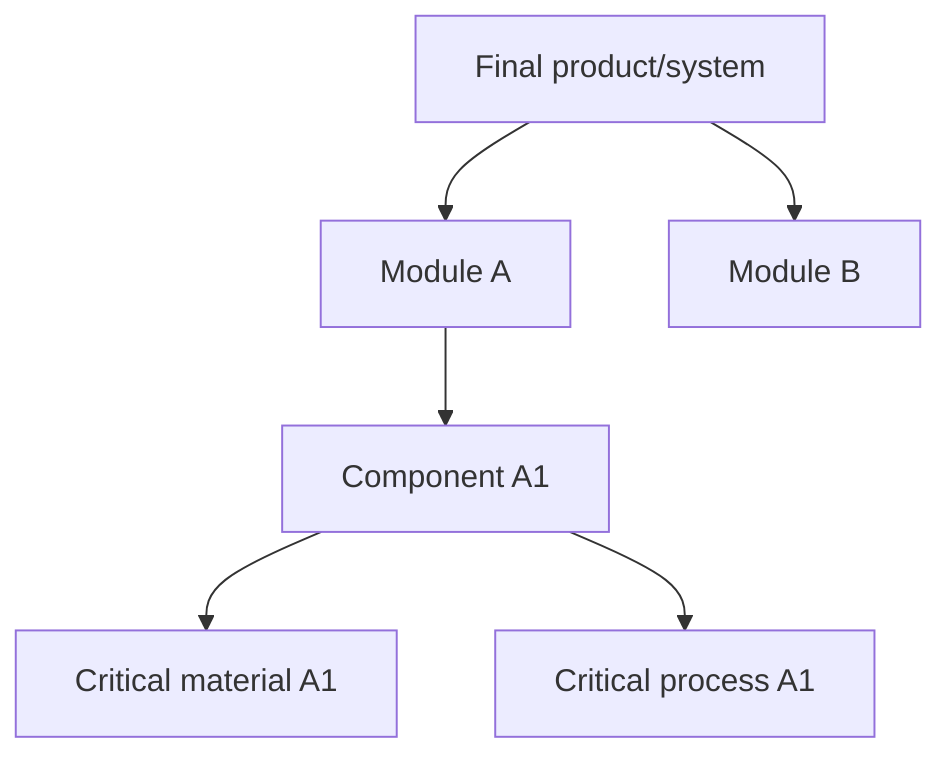
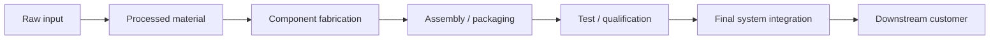
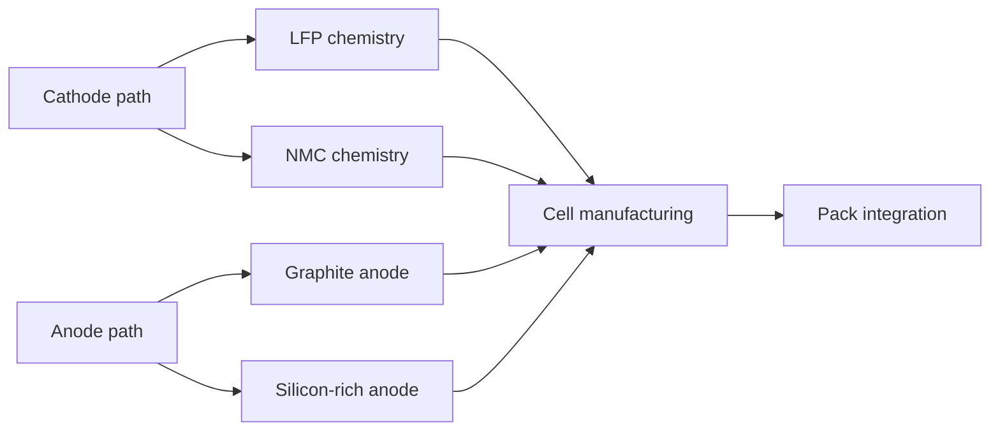
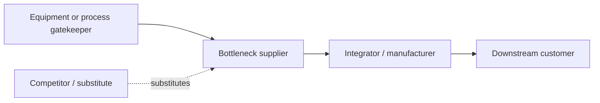
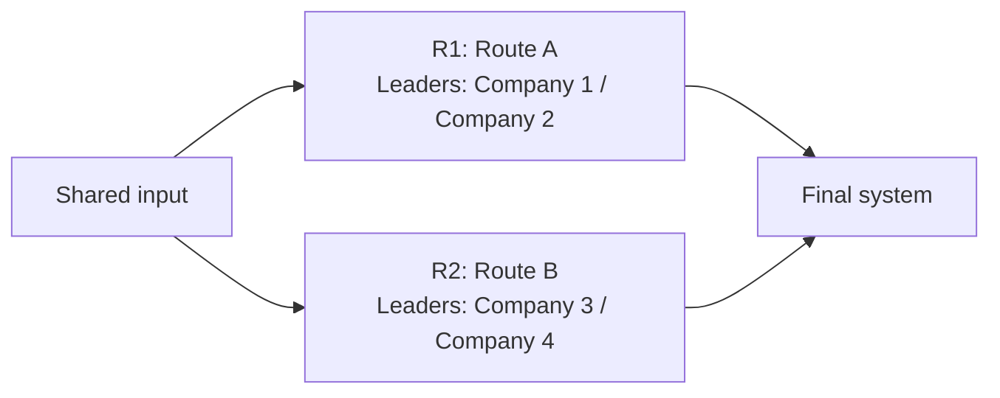
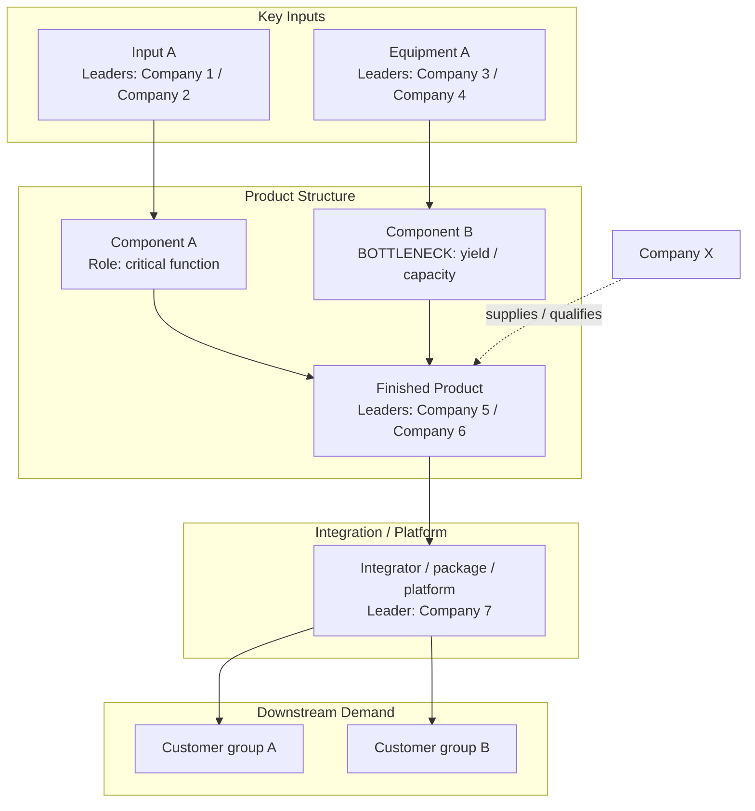

# Graph And Table Schema

Use this file when building the actual industry atlas maps.

## Diagram Rules

Prefer Mermaid diagrams because they survive Markdown-to-HTML rendering.

Use:

- `graph TD` for product decomposition trees
- `flowchart LR` for process chains
- `graph LR` for commercial relationships
- tables for dense node attributes and evidence

Do not rely on one giant all-detail diagram. For report-style outputs, use one high-level panoramic diagram and 2-4 focused drilldowns:

1. panoramic atlas: product structure plus business relationships
2. process-flow ribbon or manufacturing/process flow
3. commercial control-point map
4. bottleneck heat map if needed

Node and edge tables are production data. They should support diagram construction and QA, not appear as raw tables in the final rendered HTML.

## Panoramic Atlas Rules

Use this when the user wants an infographic-like report.

The main atlas should merge only:

- product structure: what the final product is made of
- business relationships: who controls, supplies, qualifies, or buys each node

Keep detailed manufacturing steps as a compact process ribbon or a separate map. This prevents the main diagram from becoming unreadable.

Visual encoding:

- solid arrows: physical composition or required integration path
- dashed arrows: reported, inferred, substitute, customer, or qualification relationships
- red or explicit `BOTTLENECK` labels: system constraints
- colored branch labels: competing technology routes or design variants
- node subtitles: global leaders and key customers

Recommended swimlanes:

1. key inputs: materials, equipment, wafers, IP, energy, data, or other enabling resources
2. product structure: components, modules, subsystems, test, integration
3. finished-product suppliers: companies that ship the product or subsystem
4. integration/platform layer: packaging, assembly, system, channel, or cloud platform
5. downstream demand: customers, end markets, and terminal use cases
6. bottom data strip: market size, bottleneck metrics, share, lead time, adoption, or growth data

## Node Schema

Every important node should be representable as:

| Field | Meaning |
|---|---|
| Node ID | Short stable ID such as `HBM-DRAM-DIE` |
| Node name | Human-readable component/process name |
| Category | Product, module, component, material, process, equipment, test, customer, substitute |
| Function | What this node does in the final product |
| Inputs | Required upstream inputs |
| Outputs | What it delivers downstream |
| Global leaders | Leading global companies |
| Logo / ticker hints | Visible logo, wordmark, and ticker hints for listed companies; logo or text badge for private companies |
| Listed status | Listed, private, state-owned, subsidiary, or unknown |
| Regional leaders | Important regional players or challengers |
| Downstream customers | Customers or next-chain buyers |
| Competitors | Direct competitors or substitutes |
| Route ID | Optional route label such as `R1`, `R2`, or `base route` |
| Alternative route impact | Whether alternate routes weaken, reinforce, or bypass this node |
| Bottleneck type | Capacity, yield, qualification, material, tooling, IP, geopolitics, customer dependency, none |
| Evidence status | Confirmed, likely inferred, weak, disputed, needs refresh |
| Evidence tier | Best supporting source tier, using Evidence Tier 1-6 |
| Source hooks | Short source labels tied to the evidence ledger |

## Link Schema

Every important edge should be explainable as:

| Field | Meaning |
|---|---|
| From | Upstream node |
| To | Downstream node |
| Transfer | Material, component, process output, design file, qualification approval, order flow, data, IP |
| Dependency | What must be true for the downstream node to ramp |
| Bottleneck risk | Low, medium, high |
| Route ID | Optional route label for competing technical paths |
| Route color | Suggested visual color token if routes must be separated |
| Leader companies | Companies controlling or leading the link |
| Evidence hooks | Source labels tied to the evidence ledger |

## Mermaid Pattern: Product Decomposition

Node labels should include product/component names, not long paragraphs. Put company names and evidence in tables below the diagram.

## Mermaid Pattern: Process Chain

Add branch paths when design variants matter.

Example:

## Mermaid Pattern: Commercial Ecosystem

Use dashed edges for substitutes, inferred relationships, or non-confirmed links. Label them as inferred in the table.

## Mermaid Pattern: Technology Route Divergence

Use this when competing routes materially change the supply chain or bottleneck logic.

Use route colors or labels in the rendered HTML. Do not imply one route is a supplier to another unless that is actually true.

## Mermaid Pattern: Panoramic Product-Business Atlas

Avoid placing long evidence text inside the diagram. Use source IDs in node labels only when essential, and put full source details in the evidence ledger.

## Commercial Control-Point Cards

Use 4-8 compact cards after the main atlas. Each card should cover one control point and should be rendered as a visual card, not a visible table:

| Control point | 控制 | 龙头 | 瓶颈 | 替代路线影响 | Evidence hooks |
|---|---|---|---|---|---|
|  |  |  |  |  |  |

## Node Atlas Table

Use this table for each major layer.

| Node | Role in final product | Inputs | Outputs | Global leaders | Customers / next node | Competitors or substitutes | Route ID | Bottleneck type | Evidence status |
|---|---|---|---|---|---|---|---|---|---|
|  |  |  |  |  |  |  |  |  |  |

## Bottleneck Heat Table

Render this as a vertical top-to-bottom ranking with long, narrow rows and a heat chip on the right. Avoid wide card grids.

| Rank | Node | Bottleneck thesis | Why it could bind | Global leaders | Quant signals | Evidence tier | What would break the thesis |
|---|---|---|---|---|---|---|---|
| 1 |  |  |  |  | HHI / utilization / ASP / qualification cycle if available | Tier 1-6 |  |

## Rendering Notes

To help downstream HTML rendering:

- keep headings semantic and stable
- keep Mermaid diagrams fenced with `mermaid`
- avoid over-wide single tables when a diagram plus focused table is clearer
- for infographic-like outputs, put the panoramic atlas before dense tables
- use short source IDs such as `E01`, `E02`, `E03`
- keep source URLs or document names in the evidence ledger, not inside Mermaid labels
- keep non-render node and edge tables out of final HTML unless transformed into visual graph elements
- show listed companies as logo/wordmark plus ticker where practical; use consistent badges for private companies
- use Evidence Tier 1-6, not legacy letter source labels
- use route IDs and route colors when technical routes diverge
