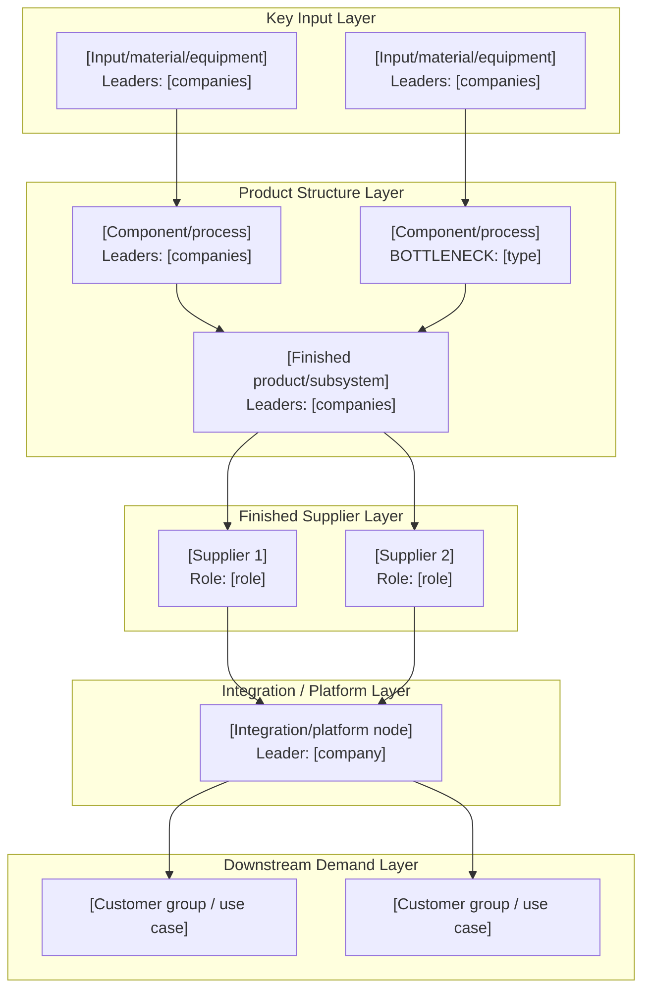
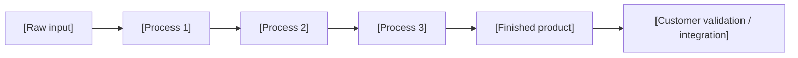

# Graph-First Markdown Template

Use this template when the user wants a Markdown file that another AI can render into an HTML consulting-style industry and business map.

The primary deliverable is the graph. Text, tables, and evidence exist to support rendering and source discipline.

````markdown
# [Industry/Product] 产业 + 商业图谱渲染指令

## Render Brief

**Primary artifact:** One panoramic industry-plus-business flowchart.

**Visual goal:** [What the reader should understand in one glance.]

**Product boundary:** [Final product, generation, architecture, geography, and time horizon.]

**Graph backbone:** Product/component/process nodes first; companies, customers, competitors, and bottlenecks as labels or relationship overlays.

**Encoding:** Solid arrows are physical product formation or integration paths; dashed arrows are supplier/customer/qualification/substitute relationships; bottleneck labels mark constraints.

**Evidence cutoff:** [Date of source refresh.]

## Visible HTML Requirements

- Final HTML must look like a long-form consulting infographic, not a Markdown document.
- Visible text should be in [target language].
- Do not render this Render Brief, Evidence Ledger, Renderer Notes, source URLs, or long reasoning paragraphs.
- Do not place generic explanatory prose under the title unless explicitly specified.
- Use clear arrows between nodes. The reader should be able to follow the chain without reading tables.
- Prefer a hand-laid SVG for the main flowchart when relationships are complex.
- Use HTML/CSS cards only for supporting blocks such as commercial control points, bottleneck heat table, and process ribbon.
- Show peer companies as parallel nodes feeding into a shared downstream node; never draw them as a sequential chain unless that is literally true.

## Visible Block 1: Main Title

| Field | Visible content |
|---|---|
| Title | [Short visible title] |
| Subtitle | [Usually omit. Use only if required and keep it under one short line.] |
| Chips | [3-5 compact tags or metrics] |

## Visible Block 2: Panoramic Industry + Business Flowchart



## Non-Render Data: Node Render Data

| Node ID | Layer | Node label | Node type | Global leaders | Customers / next node | Bottleneck status | Evidence hooks |
|---|---|---|---|---|---|---|---|
| [ID] | [Layer] | [Label] | [Input/component/product/platform/customer] | [Companies] | [Nodes/customers] | [Tier 1/Tier 2/Watchlist/None] | [E01] |

## Non-Render Data: Edge Render Data

| From | To | Relationship type | Render style | Meaning | Evidence hooks |
|---|---|---|---|---|---|
| [Node A] | [Node B] | [physical input / integration / supplier / customer / qualification / substitute] | [solid / dashed / red] | [Short explanation] | [E01] |

## Visible Block 3: Commercial Control-Point Cards

| Control point | What it controls | Global leaders | Customers / beneficiaries | Bottleneck mechanism | Evidence hooks |
|---|---|---|---|---|---|
| [Control point] | [Power or profit pool] | [Companies] | [Customers] | [Constraint] | [E01, E02] |

## Visible Block 4: Bottleneck Heat Table

| Rank | Node | Bottleneck thesis | Constraint type | Global leaders | Evidence strength | Breaker |
|---|---|---|---|---|---|---|
| 1 | [Node] | [Thesis] | [Capacity/yield/qualification/etc.] | [Companies] | [High/Medium/Low] | [What would weaken it] |

## Visible Block 5: Compact Process-Flow Ribbon



## Non-Render Data: Evidence Ledger

| ID | Source | Date | Evidence grade | Claim supported | Notes |
|---|---|---|---|---|---|
| E01 | [Source title / company / document] | [YYYY-MM-DD] | [A/B/C/D/E] | [Claim] | [Notes] |

## Renderer Notes

- Treat the Mermaid graph as the source of the visual layout.
- Use node render data for card contents and styling.
- Use edge render data for line styles and labels.
- Use evidence hooks only for hidden QA or optional hover citations; do not show the full Evidence Ledger.
- Keep detailed prose out of the rendered graph.
- If converting Mermaid to custom SVG, preserve the node order, edge direction, dashed commercial relationships, and bottleneck styling.
````
