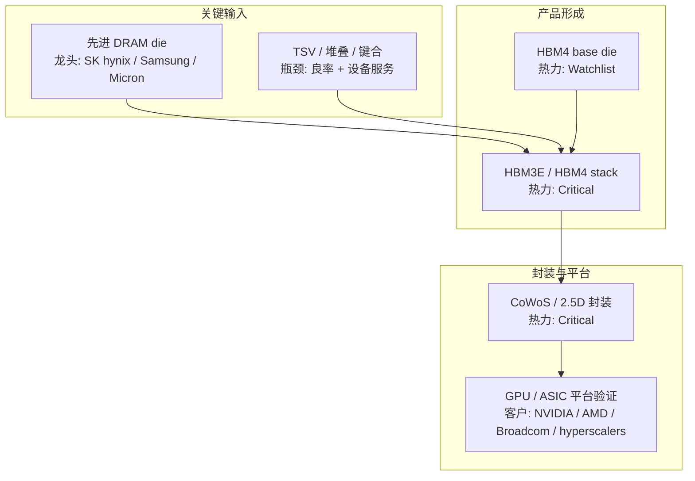
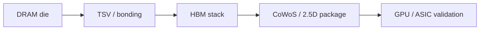

# HBM Mini Example

Use this as a compact end-to-end example of the expected Markdown shape. It is illustrative and not source-refreshed.

## Input

```yaml
product: HBM
generation: HBM3E/HBM4
geography: global
time_horizon: sector-appropriate outlook, starting from 12-24 months
depth: full
output_mode: interactive
compare_routes: auto
include_quant_signals: true
```

## Scope Confirmation Gate

| Field | Draft confirmation content |
|---|---|
| Product tree | HBM stack -> DRAM dies / TSV / bonding / base die / thermal and test -> CoWoS or 2.5D package -> AI accelerator platform |
| Proposed swimlanes | key inputs; stack formation; finished HBM suppliers; advanced packaging; AI accelerator customers |
| Preliminary top-3 bottlenecks | HBM stack supply; CoWoS or 2.5D packaging; customer qualification |
| Technology routes | R1: HBM3E stack; R2: HBM4 with base die and tighter logic/foundry coordination |
| Assumptions needing confirmation | Treat HBM as AI accelerator memory subsystem, not generic DRAM; use global scope |

Ask the user to confirm or adjust before final atlas generation.

## Render Brief

**Primary artifact:** One panoramic HBM industry-plus-business flowchart.

**Evidence cutoff:** not refreshed.

**Source freshness:** needs refresh.

**Mode:** interactive with scope confirmation.

## HTML Renderer Allowlist

Render only: Main Title, Panoramic Industry + Business Flowchart, Compact Process-Flow Ribbon, Commercial Control-Point Cards, Bottleneck Heat Table, Small Legend.

Do not render: Scope Confirmation Gate, Node Production Data, Edge Render Data, Company Badge Data, Evidence Ledger, raw JSON, source URLs, raw Markdown backup, standalone layer inventory.

## Visible Block: Panoramic Industry + Business Flowchart



Renderer must route arrows around text and badges; arrows must not cover node labels, company labels, tickers, metrics, or bottleneck tags.

## Visible Block: Compact Process-Flow Ribbon

Place this directly below the panoramic graph.



## Non-Render Data: Node Production Data

| Node ID | Layer | Node label | Node type | Function / role | Inputs | Outputs | Global leaders | Regional leaders | Logo / ticker hints | Route ID | Customers / next node | Competitors / substitutes | Bottleneck heat | Claim state | Source freshness | Evidence tier | Evidence hooks |
|---|---|---|---|---|---|---|---|---|---|---|---|---|---|---|---|---|---|
| HBM-STACK | 产品形成 | HBM3E/HBM4 stack | Product subsystem | Provides high-bandwidth memory close to accelerator compute | DRAM dies; TSV; bonding; test | Finished HBM stack | SK hynix; Samsung; Micron | none material in example | SK hynix (000660.KS); Samsung (005930.KS); Micron (MU) | R1/R2 | CoWoS / GPU platform | GDDR; CXL memory pooling; on-package SRAM | Critical | weakly inferred | needs refresh | Tier 4 | E01 |
| ADV-PKG | 封装与平台 | CoWoS / 2.5D package | Integration process | Integrates HBM stack with accelerator compute die | HBM stack; interposer; substrate; compute die | Accelerator package | TSMC | OSAT challengers depending scope | TSMC (TSM) | base | GPU / ASIC platform | alternate advanced packaging routes | Critical | weakly inferred | needs refresh | Tier 4 | E02 |

## Non-Render Data: Company Badge Data

| Company | Listed status | Ticker | Logo / wordmark hint | Fallback badge text | Notes |
|---|---|---|---|---|---|
| SK hynix | listed | 000660.KS | SK hynix wordmark | SK hynix 000660.KS | HBM supplier |
| Samsung Electronics | listed | 005930.KS | Samsung wordmark | Samsung 005930.KS | HBM supplier |
| Micron | listed | MU | Micron wordmark | Micron MU | HBM supplier |
| TSMC | listed | TSM | TSMC wordmark | TSMC TSM | Advanced packaging |

## Non-Render Data: Edge Render Data

| From | To | Relationship type | Render style | Route ID | Meaning | Claim state | Evidence tier | Evidence hooks |
|---|---|---|---|---|---|---|---|---|
| HBM-STACK | ADV-PKG | integration | solid red | base | HBM stack must be integrated with compute die through advanced packaging | weakly inferred | Tier 4 | E02 |

## Visible Block: Commercial Control-Point Cards

| Control point | 控制 | 龙头 | 瓶颈 | 替代路线影响 | Optional customer / validation note | Evidence hooks |
|---|---|---|---|---|---|---|
| HBM 成品供应 | 已认证 HBM3E/HBM4 供货 | SK hynix / Samsung / Micron | 产能 + 良率 + 客户验证 | CXL/GDDR 只能部分缓解 | AI accelerator qualification | E01 |
| CoWoS / 2.5D 封装 | HBM 与 compute die 集成 | TSMC | 先进封装产能 | alternate packaging routes may weaken over time | GPU package ramp | E02 |

## Visible Block: Bottleneck Heat Table

| Rank | Node | Bottleneck heat | Bottleneck thesis | Constraint type | Global leaders | Quant signals | Evidence tier | Breaker |
|---|---|---|---|---|---|---|---|---|
| 1 | HBM stack supply | Critical | AI accelerator ramp can be gated by qualified HBM output | capacity / yield / qualification | SK hynix / Samsung / Micron | concentration: high; numeric HHI unknown | Tier 4 | broad qualified supply catches up |
| 2 | CoWoS / 2.5D package | Critical | HBM and compute die must be integrated into package before platform shipment | packaging capacity | TSMC | utilization unknown; lead-time signal unknown | Tier 4 | capacity expansion clears wait time |

## Non-Render Data: Evidence Ledger

| ID | Source | Date | Evidence tier | Claim state | Claim supported | Method / metric note | Notes |
|---|---|---|---|---|---|---|---|
| E01 | Placeholder industry reporting to refresh | not refreshed | Tier 4 | stale | HBM stack supply as major bottleneck | no numeric method used | Replace with current filings, earnings calls, and industry reports |
| E02 | Placeholder industry reporting to refresh | not refreshed | Tier 4 | stale | CoWoS / 2.5D packaging as major bottleneck | no numeric method used | Replace with current foundry and packaging evidence |
