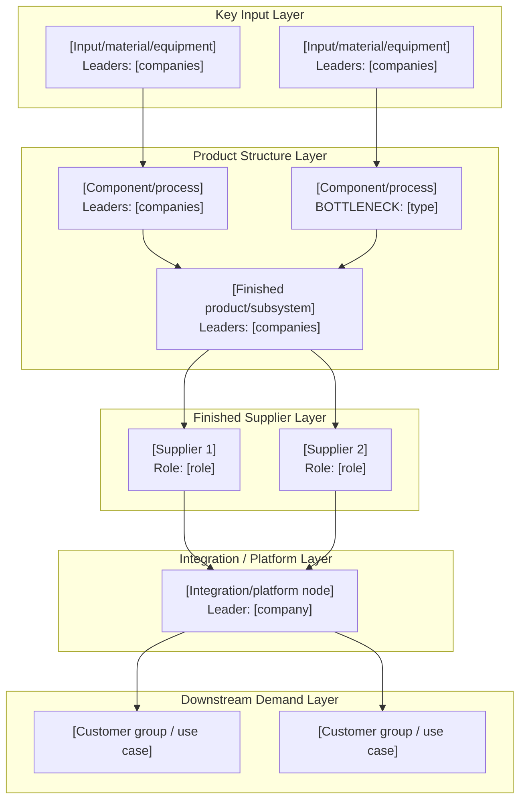
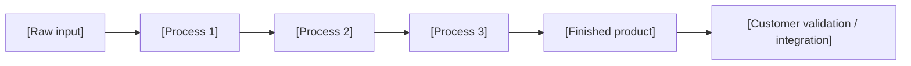

# Graph-First Markdown Template

Use this template when the user wants a Markdown file that another AI can render into an HTML consulting-style industry and business map.

The primary deliverable is the graph. Text, tables, and evidence exist to support rendering and source discipline.

````markdown
# [Industry/Product] 产业 + 商业图谱渲染指令

## Render Brief

**Primary artifact:** One panoramic industry-plus-business flowchart.

**Visual goal:** [What the reader should understand in one glance.]

**Product boundary:** [Final product, generation, architecture, geography, and time horizon.]

**Graph backbone:** Product/component/process nodes first; companies, customers, competitors, and bottlenecks as labels or relationship overlays.

**Encoding:** Solid arrows are physical product formation or integration paths; dashed arrows are supplier/customer/qualification/substitute relationships; bottleneck labels mark constraints.

**Evidence cutoff:** [Date of source refresh.]

**Source freshness:** [refreshed / not refreshed / stale / needs refresh]

**Mode:** [interactive with scope confirmation / one-pass with stated assumptions]

## Visible HTML Requirements

- Final HTML must look like a long-form consulting infographic, not a Markdown document.
- Visible text should be in [target language].
- Do not render this Render Brief, Evidence Ledger, Renderer Notes, source URLs, or long reasoning paragraphs.
- Do not render Node Production Data or Edge Render Data as raw tables. Use them only to create visual nodes, arrows, badges, and hidden QA metadata.
- Do not build navigation or section numbering from all Markdown headings. Use only the visible-section allowlist below.
- Do not place generic explanatory prose under the title unless explicitly specified. The title area should normally contain only the main title, optional evidence-cutoff text, and compact chips/tags.
- Use clear arrows between nodes. The reader should be able to follow the chain without reading tables.
- Arrows and connector lines must not cover node titles, labels, company badges, tickers, metric chips, or bottleneck labels. Use routed edges, gutters, node-border anchors, and spacing; if overlap remains, split the graph or move detail into a drilldown.
- Prefer a hand-laid SVG for the main flowchart when relationships are complex.
- Use HTML/CSS cards only for supporting blocks such as commercial control points, bottleneck heat table, and process ribbon.
- Show peer companies as parallel nodes feeding into a shared downstream node; never draw them as a sequential chain unless that is literally true.
- Render bottleneck heatmaps as a vertical top-to-bottom ranking with long, narrow rows, not as a wide grid of cards.
- Render commercial control points as compact two-column cards. Each card should mainly show `控制`, `龙头`, and `瓶颈`.
- Show listed companies with logo or wordmark plus ticker badges where practical. Show unlisted companies with logo/wordmark or a consistent text badge. Avoid plain comma-separated company lists when badge data exists.
- If technical routes diverge, show route branches with distinct colors or route labels and explain `替代路线影响` in control-point cards.
- Use Evidence Tier 1-6 in source data. Do not use legacy letter source labels.
- Use claim-state and bottleneck-heat labels from `evidence-standard.md`.
- If source freshness is `not refreshed`, do not render any newly introduced supplier/customer claim as confirmed.
- Layer or swimlane metadata must only appear as graph lane labels or grouped backgrounds inside the main flowchart. Do not create a standalone section named `产业分层节点`, `分层节点表`, `Layer Nodes`, or similar unless the user explicitly asks for a technical appendix.

## HTML Renderer Allowlist

The final HTML may render only these blocks:

| Block | Render rule |
|---|---|
| Main Title | Visible title, optional evidence-cutoff text, compact chips; no long subtitle paragraph by default |
| Panoramic Industry + Business Flowchart | Main SVG/HTML graph with arrows and swimlanes |
| Compact Process-Flow Ribbon | Optional if it clarifies how the product is formed; place directly below the panoramic flowchart |
| Commercial Control-Point Cards | Compact card grid using `控制 / 龙头 / 瓶颈 / 替代路线影响` |
| Bottleneck Heat Table | Vertical ranking with long, narrow rows |
| Small Legend | Optional arrow, heat, and route legend |

Forbidden in final HTML:

- Scope Confirmation Gate
- Render Brief instructions
- Node Production Data table
- Edge Render Data table
- Company Badge Data table
- Evidence Ledger
- Renderer Notes
- raw JSON or machine-readable blocks
- raw Markdown backup
- source URL list or bibliography
- investment/research observation tables
- standalone layer inventory such as `产业分层节点`
- any section created only because it appears as a Markdown heading

If a renderer includes any forbidden block as a visible HTML section, the rendering is invalid.

## Scope Confirmation Gate

Use this section before final atlas generation in interactive mode. Do not render it in the final HTML.

| Field | Draft confirmation content |
|---|---|
| Product tree | [3-5 level tree summary] |
| Proposed swimlanes | [Main atlas swimlanes] |
| Preliminary top-3 bottlenecks | [Preliminary, not final] |
| Technology routes | [Route IDs or "none material"] |
| Assumptions needing confirmation | [Short list] |

## Visible Block 1: Main Title

| Field | Visible content |
|---|---|
| Title | [Short visible title] |
| Subtitle | [Usually omit. Do not use a long explanatory route/time-window paragraph.] |
| Chips | [3-5 compact tags or metrics] |

## Visible Block 2: Panoramic Industry + Business Flowchart



Render rule: convert the graph to SVG/HTML with edge routing that keeps all arrows and labels outside text and badge areas. Use company badge data to show listed-company logo/wordmark plus ticker badges inside or next to relevant nodes.

## Visible Block 3: Compact Product-Formation / Process-Flow Ribbon

Place this block directly below the panoramic flowchart when it clarifies how the product is formed.



## Non-Render Data: Node Production Data

| Node ID | Layer | Node label | Node type | Function / role | Inputs | Outputs | Global leaders | Regional leaders | Logo / ticker hints | Route ID | Customers / next node | Competitors / substitutes | Bottleneck heat | Claim state | Source freshness | Evidence tier | Evidence hooks |
|---|---|---|---|---|---|---|---|---|---|---|---|---|---|---|---|---|---|
| [ID] | [Layer] | [Label] | [Input/component/product/platform/customer] | [Role in final product] | [Required inputs] | [Delivered outputs] | [Companies] | [Regional challengers] | [Logo or wordmark + ticker where practical] | [R1/R2/base/none] | [Nodes/customers] | [Substitutes] | [Critical/High/Watchlist/Not bottleneck] | [confirmed/strongly inferred/weakly inferred/speculative/disputed/stale] | [refreshed/not refreshed/stale/needs refresh] | [Tier 1-6] | [E01] |

## Non-Render Data: Company Badge Data

Use this table to render visible company badges. Do not display this table itself.

| Company | Listed status | Ticker | Logo / wordmark hint | Fallback badge text | Notes |
|---|---|---|---|---|---|
| [Company] | [listed/private/subsidiary/state-owned/unknown] | [Ticker or none] | [Logo source hint or wordmark] | [Short fallback label] | [Optional note] |

## Non-Render Data: Edge Render Data

| From | To | Relationship type | Render style | Route ID | Meaning | Claim state | Evidence tier | Evidence hooks |
|---|---|---|---|---|---|---|---|---|
| [Node A] | [Node B] | [physical input / integration / supplier / customer / qualification / substitute] | [solid / dashed / red / route-color] | [R1/R2/base/none] | [Short explanation] | [confirmed/strongly inferred/weakly inferred/speculative/disputed/stale] | [Tier 1-6] | [E01] |

## Visible Block 4: Commercial Control-Point Cards

Render these as compact cards, not as a visible table. Use two columns on desktop and one column on mobile.

| Control point | 控制 | 龙头 | 瓶颈 | 替代路线影响 | Optional customer / validation note | Evidence hooks |
|---|---|---|---|---|---|---|
| [Control point] | [Power or profit pool in one phrase] | [Logo/ticker badges or company names] | [Constraint in one phrase] | [Bypass / weaken / reinforce / none] | [Optional short note] | [E01, E02] |

## Visible Block 5: Bottleneck Heat Table

Render this as a vertical top-to-bottom ranking with long, narrow rows. Do not render it as a wide card grid.

| Rank | Node | Bottleneck heat | Bottleneck thesis | Constraint type | Global leaders | Quant signals | Evidence tier | Breaker |
|---|---|---|---|---|---|---|---|---|
| 1 | [Node] | [Critical/High/Watchlist/Not bottleneck] | [Thesis] | [Capacity/yield/qualification/etc.] | [Companies] | [concentration / HHI proxy / utilization / ASP trend / qualification cycle if available; unknown if not; include method + evidence ID for numeric metrics] | [Tier 1-6] | [What would weaken it] |

## Non-Render Data: Evidence Ledger

| ID | Source | Date | Evidence tier | Claim state | Claim supported | Method / metric note | Notes |
|---|---|---|---|---|---|---|---|
| E01 | [Source title / company / document] | [YYYY-MM-DD] | [Tier 1-6] | [confirmed/strongly inferred/weakly inferred/speculative/disputed/stale] | [Claim] | [Calculation method if a metric is used] | [Notes] |

## Renderer Notes

- Treat the Mermaid graph as a source spec or layout brief. Use custom SVG/HTML when the final long infographic needs precise styling.
- Use node production data for visual node/card contents and styling; do not display the node table itself.
- Use edge render data for line styles and labels; do not display the edge table itself.
- Use company badge data for visible company labels; do not display the company badge table itself.
- Use evidence hooks only for hidden QA or optional hover citations; do not show the full Evidence Ledger.
- Keep detailed prose out of the rendered graph.
- If converting Mermaid to custom SVG, preserve the node order, edge direction, dashed commercial relationships, and bottleneck styling.
- If converting Mermaid to custom SVG, redraw edges manually when necessary so arrows never obscure text, logos, ticker badges, or metric chips.
- Company visuals should prefer logo/wordmark plus ticker for listed companies and logo/wordmark or text badge for private companies.
- Preserve route IDs and route colors when technical routes diverge.
- Treat missing quantitative indicators as `unknown`; do not invent numbers.
- Build final HTML navigation only from the visible-section allowlist.
````
